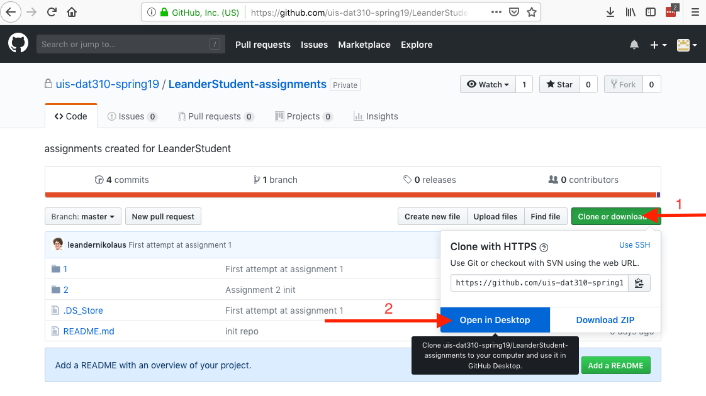

# Using GitHub for DAT310

  * [Repositories](#repositories)
  * [How to use GitHub?](#how-to-use-github)
  * [Step-by-Step How-To](#step-by-step-how-to)

## Repositories

There are three GitHub repositories:

  * [dat310-2022/info](https://github.com/dat310-2022/info/): (i.e., this repository) contains examples, exercises, etc. (public)
  * [dat310-2022/{yourname}-assignments](https://github.com/dat310-2022/): your submissions for the assignments ({yourname} is to be substituted with the username you registered on GitHub) (private)
  * [dat310-2022/assignments](https://github.com/dat310-2022/assignments): contains assignment descriptions

Private means that you need to sign up on the [Online Course Admin](https://ux.uis.no/~ljehl/dat310/) to get access to these repositories. (*Note that the private repositories are created manually, in batches, so you might need to wait 1-2 days after you signed up.*)

### Examples and exercises (course-info)

You can clone this repository to get a local copy of the examples and exercises. This is the fastest way to get started on exercises during class.
This is a good option especially for some more advanced exercises, that have a initial setup of multiple files to get you started. 
These start files may not work, if you change the relative location of files.

The procedure to clone the course-info repository is the same as described below.

### Your assignments ({username}-assignments)

This is your private repository; no one will (or can) make changes here but you. 
Clone this repository on your computer, add/edit the files in the folder corresponding to the given assignment, then commit and push ("sync") the changes. You can make sure that your changes have been submitted by checking the contents on the web interface:
https://github.com/dat310-2022/{username}-assignments

  * If the link does not work, then you might have to accept the GitHub invitation first (this is to be done only once). Go to https://github.com/dat310-2022, where you should see an Accept button. Then, you will be able to access your repository.
  * When a new assignment is published, I will create a folder with starting code for this assignment and push it to your assignments repository. Make sure to pull ("sync") the starting code before starting on the assignment. It is important that the solution to your assignment is delivered within this folder.
* **To hand in assignment 1** you push this repository to github, containing your solution in the folder named 1. 
At deadline, I will download your assignments and correct them together with the student assistants.
 
### Assignments (assignments)

This repository contains the description of assignments.
You can clone the repository to have a local copy. You don't have permissions to make changes.

## How to use GitHub?

You can use a graphical client. I recommend the official GitHub client (GitHub Desktop), which is available for both Windows and Mac: https://desktop.github.com/.

You can also work from the command line (for geeks). Here is a crash course: http://try.github.io.

### General workflow

  0. Clone repository (to be done only once)
  1. Pull changes from server (`pull`)
  2. Make local changes (edit/add/delete files)
  3. Commit changes to locally (`commit`)
  4. Push changes to server (`push`)

*In GitHub desktop, both pull and push are called "sync".*

## Step-by-Step How-To

(Illustrated using GitHub Desktop.)

The first two steps are to be done only once.

### 1. Install GitHub Desktop

Download it from: https://desktop.github.com/

* Register with your github username and password.

### 2. Clone your assignments repository

  * Go to your private repository: https://github.com/dat310-2022/{yourname}-assignments
  * Click the *clone in Desktop* button.

  * Specify the target folder, then you’ll see something like this:

  * You can open your location using the link in the tool.

### 3. For each assignment

  * Click the *fetch* button to see if anything new is available. (Will not be necessary for assignment 1 and 2.)

  * If new changes are available, you can click *pull* to add them to your local repository. (Will not be necessary for assignment 1 and 2.)

 * When you have done changes to the files and added your solution. Commit them.
 * Fill in the *Summary* (doesn't matter what you put there); the *Description* can be left empty.

 * After commiting *push* changes to github.

 

That's it. You can double check on the web interface if your changes have been synchronized.

Note that you can submit any number of times; feel free to use this repository as your back-up. Your submission will be evaluated (i.e., looked at) only after the submission deadline.  
