# Bootstrap exercises

## Exercise #1: 960.gs

This is not an exercise about Bootstrap (yet).

Complete [exercise1.html](exercise1.html) such that that page displays as shown below:
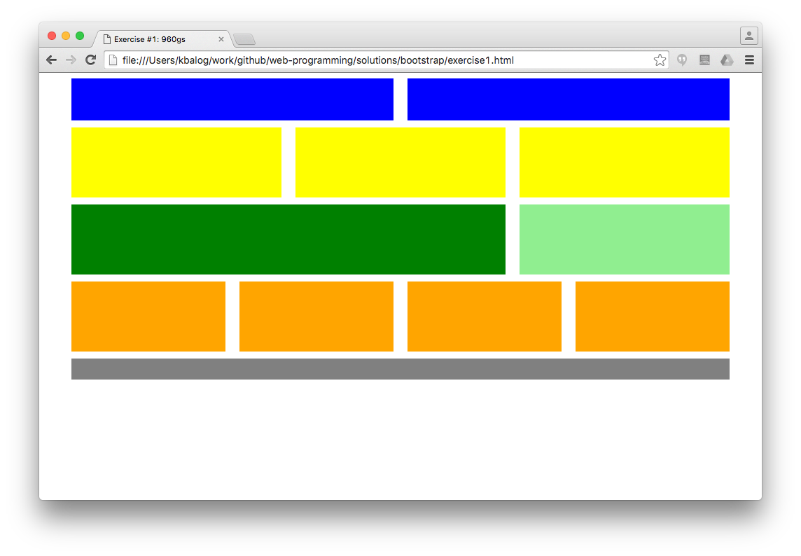

You need to create the boxes using the prepared CSS classes. See [this page](http://960.gs/demo.html) for an example.

Hint: the first (blue) box becomes:

```html
<div class="grid_6">
  <div class="blue"></div>
</div>
```

## Exercise #2a: Grid layout

Complete [exercise2a.html](exercise2a.html) to create the following layout using Bootstrap.


Hint: use [Rows and columns](https://getbootstrap.com/docs/5.0/layout/columns/) and [background colors](https://getbootstrap.com/docs/5.0/utilities/colors/#background-color)

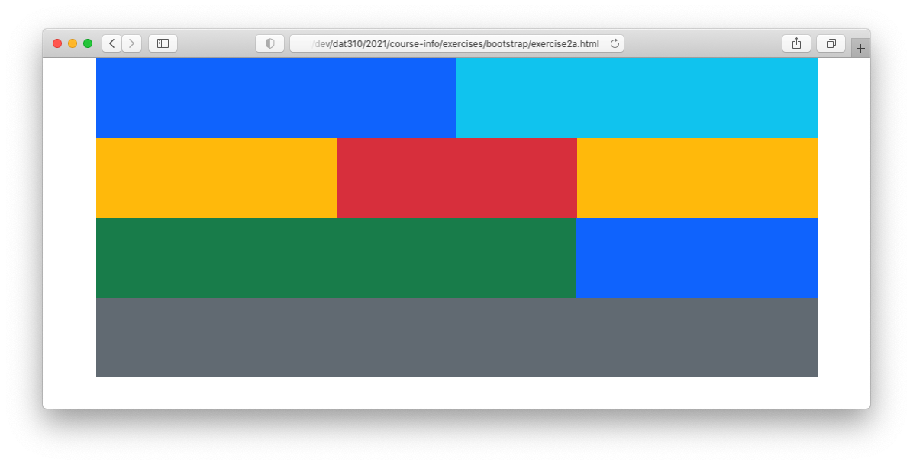

## Exercise #2b: Responsive layout

Include breakpoints to make the design from exercise #2a responsive. 

Hint: use [grid system](https://getbootstrap.com/docs/5.0/layout/grid/) on rows and [display utility](https://getbootstrap.com/docs/5.0/utilities/display/)

Mobile view:
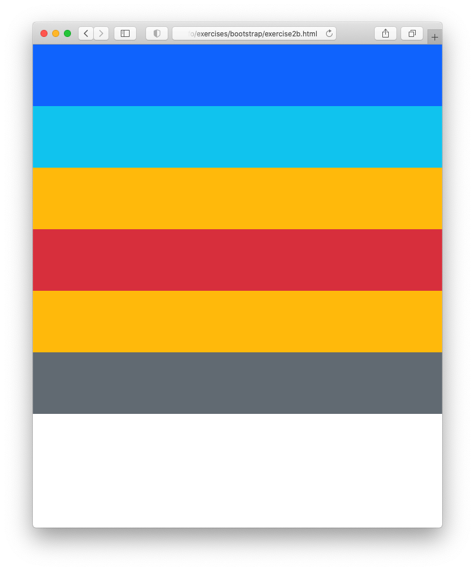

Desktop view:


## Exercise #2c: Spacing

Add spacing between columns and rows. This requires to add one level of nesting to the design.
Start from [exercise2c.html](exercise2c.html).

Hint: use [grid system](https://getbootstrap.com/docs/5.0/layout/grid/) on rows and [display utility](https://getbootstrap.com/docs/5.0/utilities/display/)

Mobile view:
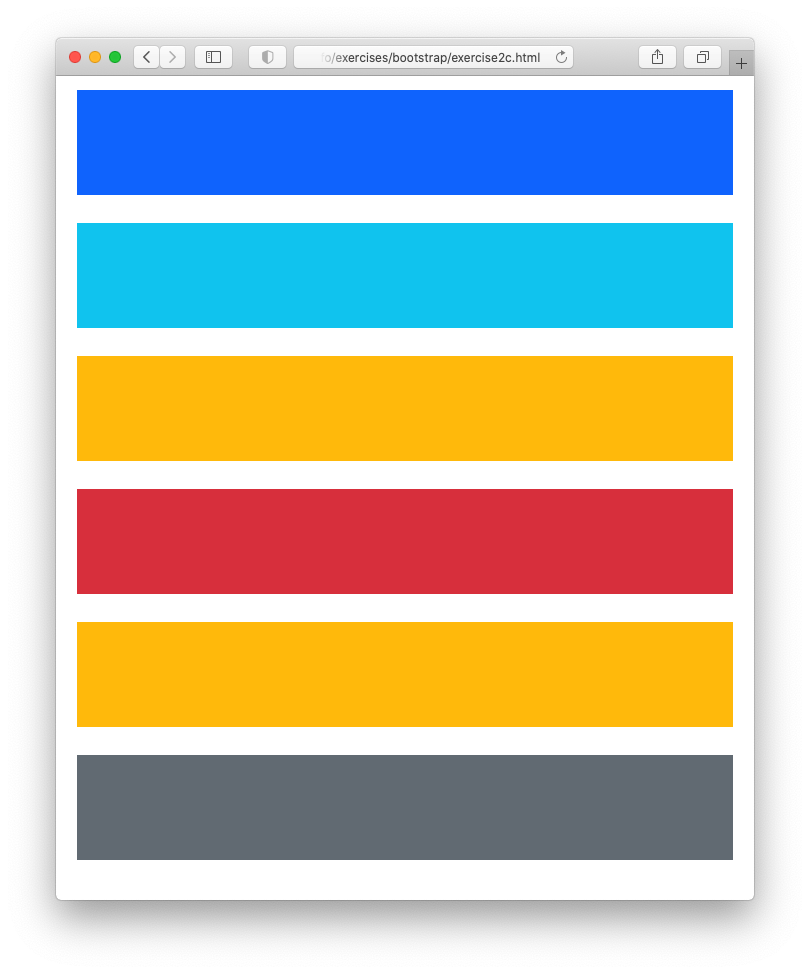

Desktop view:
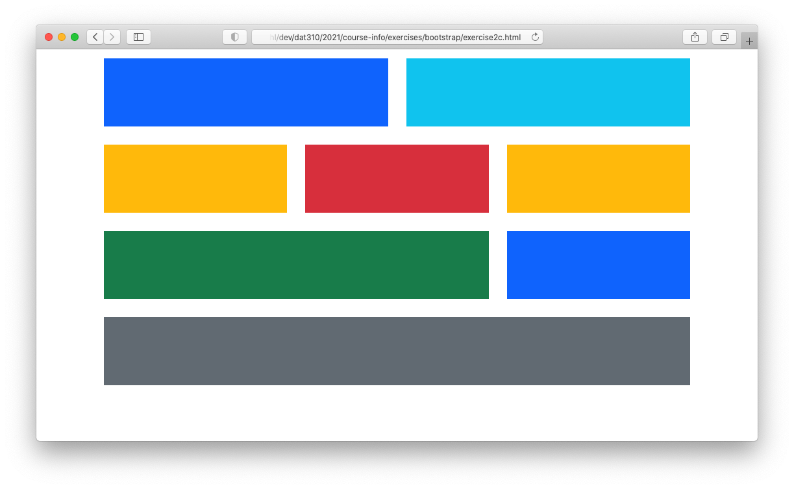

## Exercise #3: Tables

Add Bootstrap classes to [exercise3.html](exercise3.html) to create the following 4 tables:

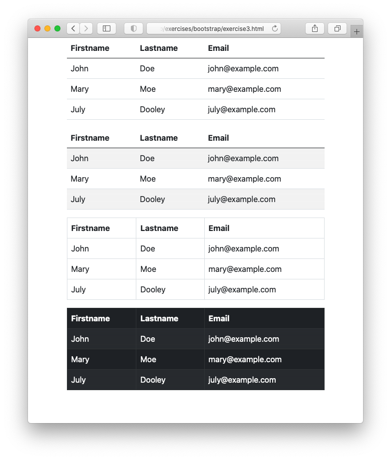


## Exercise #4: Simple form

Style the form given in [exercise4.html](exercise4.html) using Bootstrap. (You will also need to include the Bootstrap css file in the header.) See the [Bootstrap form documentation](https://getbootstrap.com/docs/5.0/forms/overview/) for help.
Add some margin between the groups using `mb-3`.


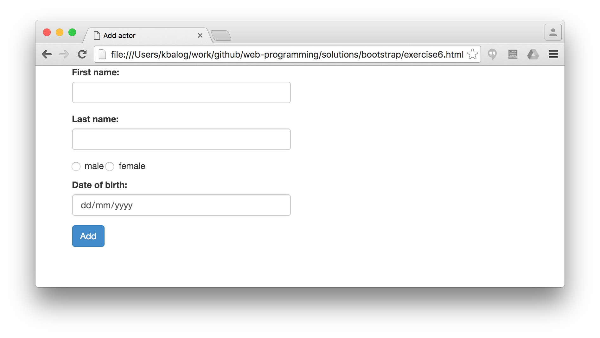

## Exercise #5: Responsive form

Create a responsive form, as shown below. You can use the [form.html](../../examples/bootstrap/form.html) as starting point.
Remember to create new elements for nested rows.

Mobile view:
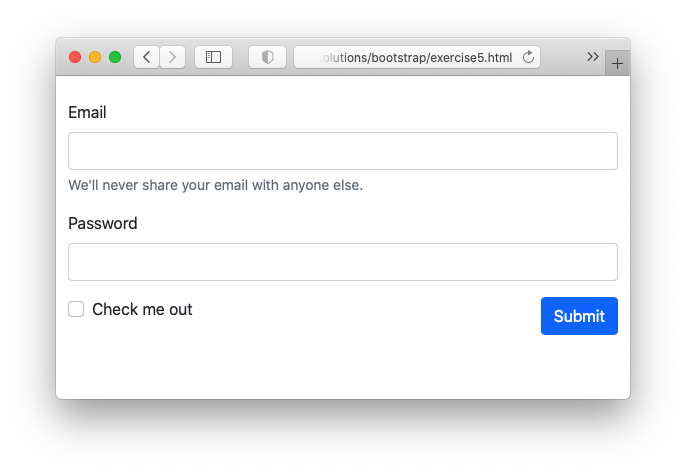

Desktop view:
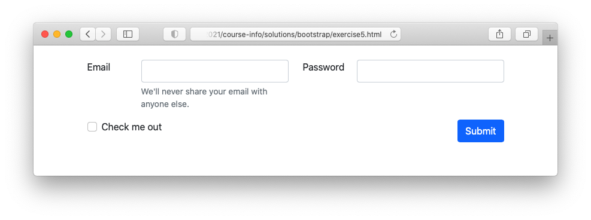

## Exercise #6: Wild & Wacky Vegetables

Format and extend the given [starer html file](exercise6.html) using Bootstrap by following the steps below.

1) Use the [Bootstrap grids classes](https://getbootstrap.com/docs/5.0/layout/grid) to create a sidebar and main content.
Use a [card](https://getbootstrap.com/docs/5.0/components/card/#titles-text-and-links)  and [nav list](https://getbootstrap.com/docs/5.0/components/navs-tabs/#vertical) to style the sidebar.

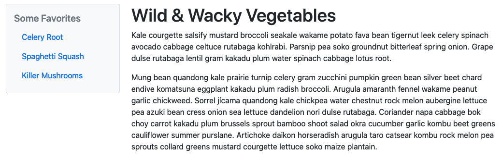

1)  Add a [quote](https://getbootstrap.com/docs/5.0/content/typography/#blockquotes), [table](https://getbootstrap.com/docs/5.0/content/tables/), and search form to the page:

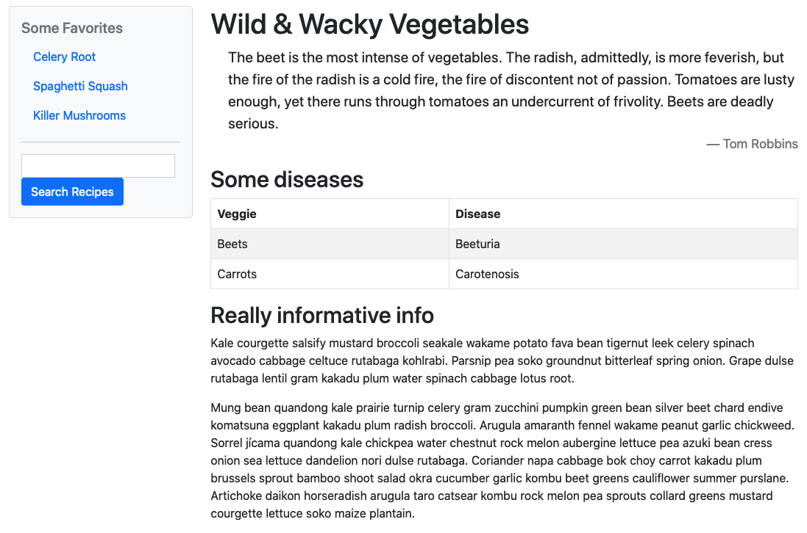

3) Use the [Bootstrap alert component](https://getbootstrap.com/docs/5.0/components/alerts) to add a danger alert. Use the [thumbnails classes](https://getbootstrap.com/docs/5.0/content/images) to give the images borders.

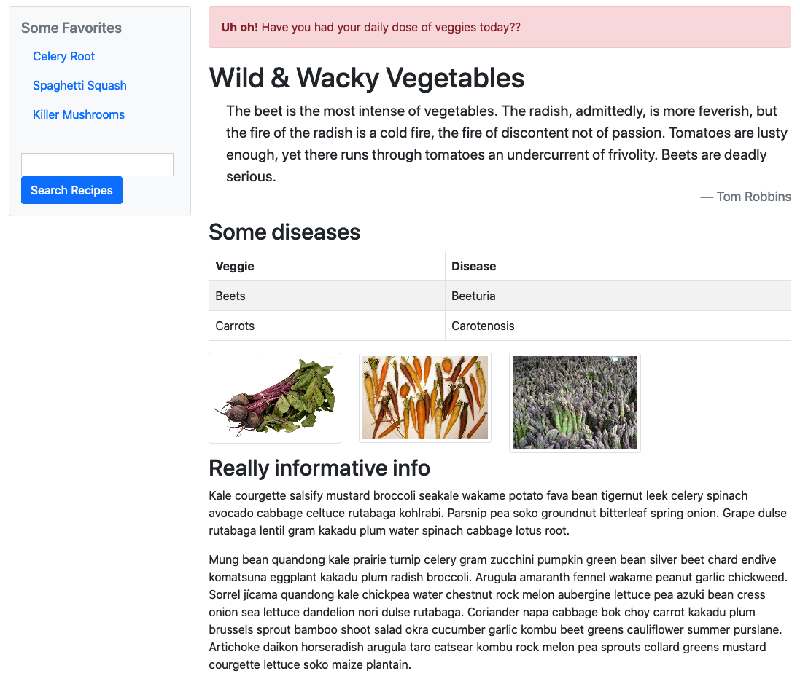


## Exercise #7: Components

Try the some Bootstrap components in action by building the following page step-by-step. There is no starter file for this exercise, you need to code everything from scratch.

1) Add a navigation bar, a full-width element, and 3 columns with some content.
   - Use custom css only for background color `#e2e3e5`.
   - Use [text classes](https://getbootstrap.com/docs/5.0/content/typography/#display-headings)
   - Add appropriate padding

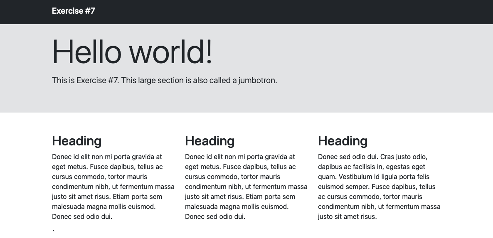

2) Extend the navigation bar with the followings:
  - The navbar should always be fixed on the top of the screen.
  - Add three menu items plus a dropdown menu to the left. Mark the second menu item as active.
  - Add a sign-in form with email and passwords fields to the right.

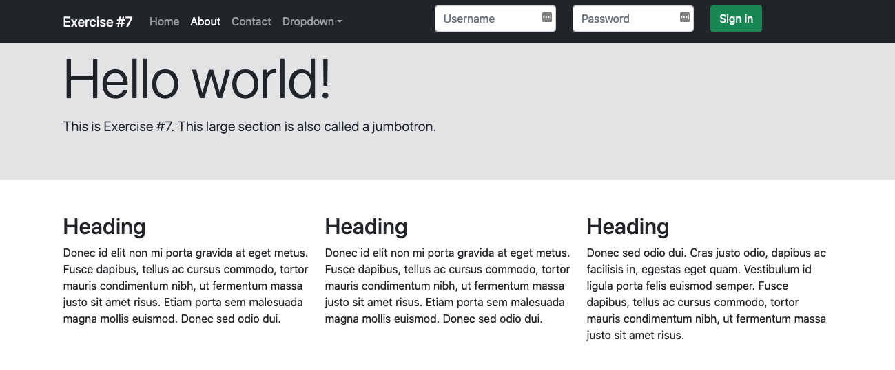
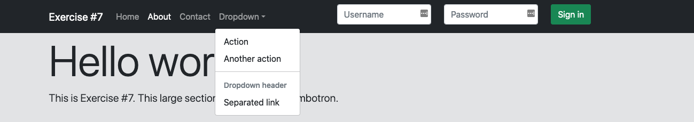

  - The navbar should collaps on mobile screens:

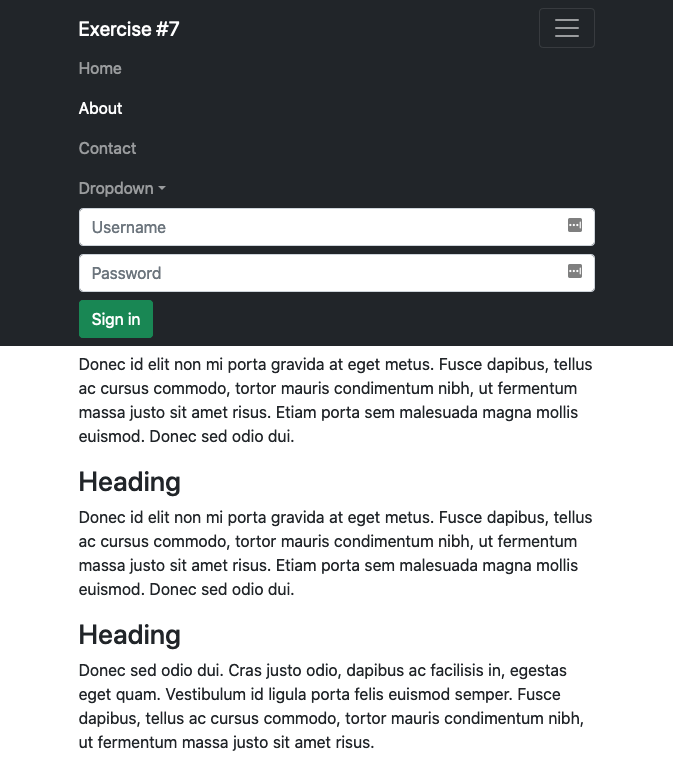

3) Add some buttons, a dismissable alert, a "New" badge, and a small pill badge showing the number of contacts.

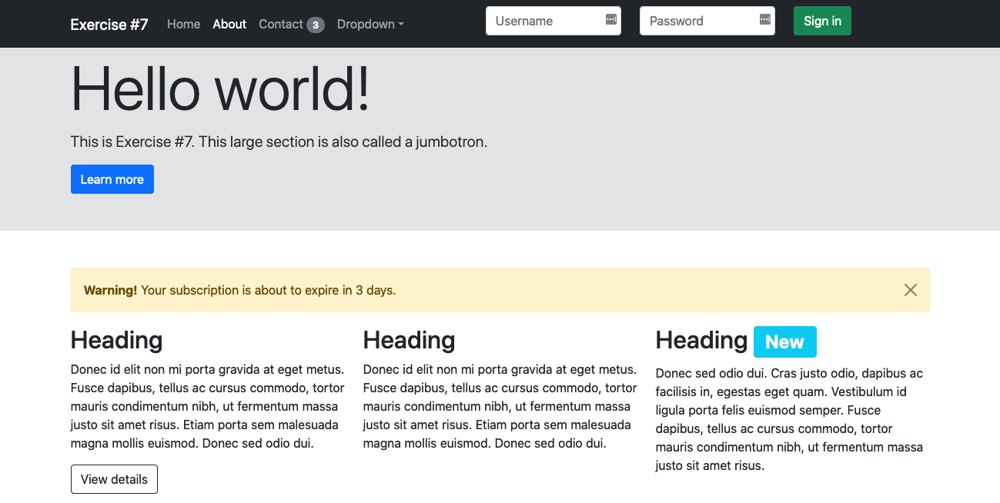
