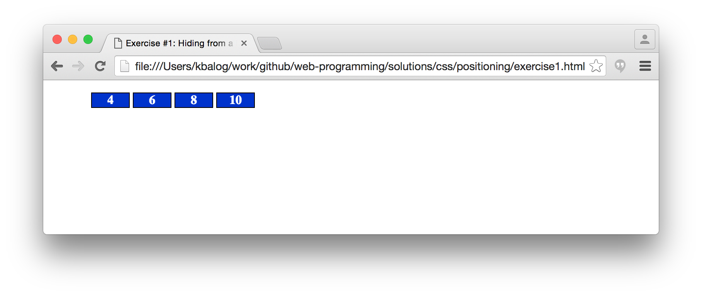
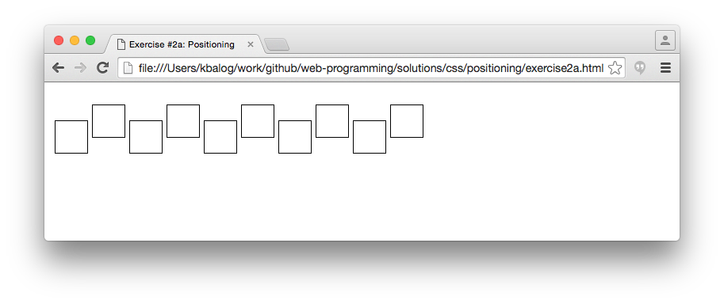
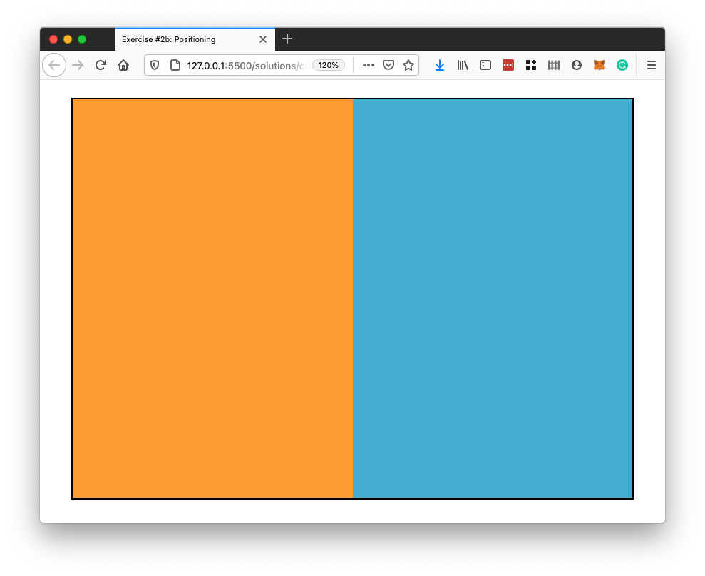
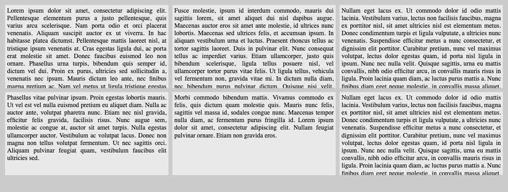
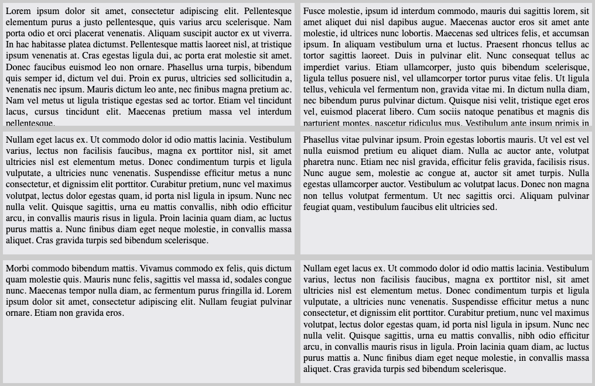
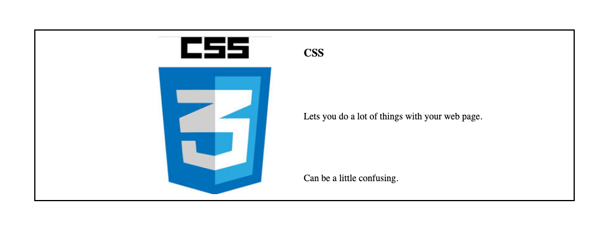
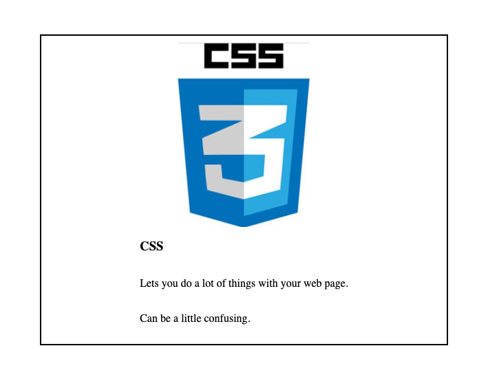
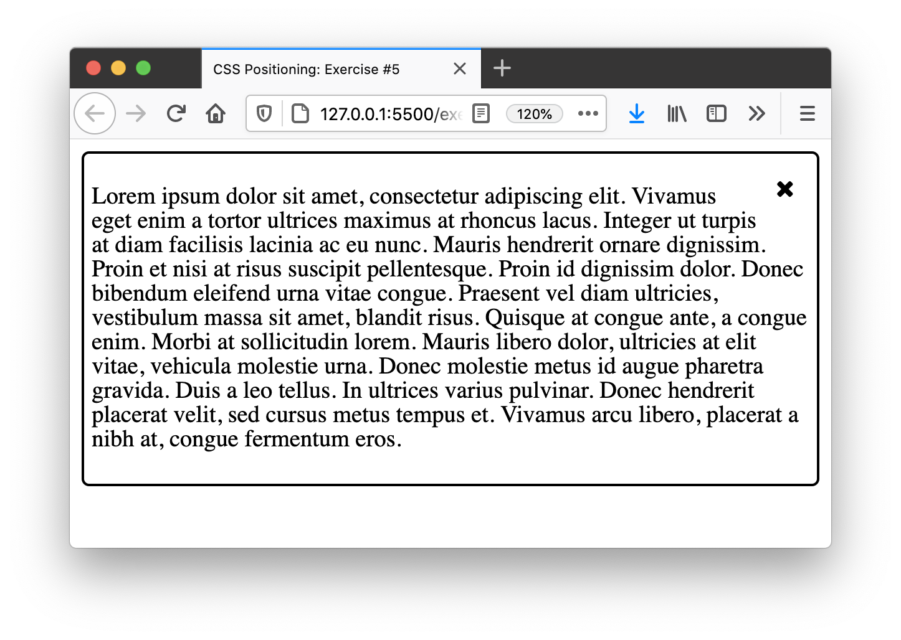
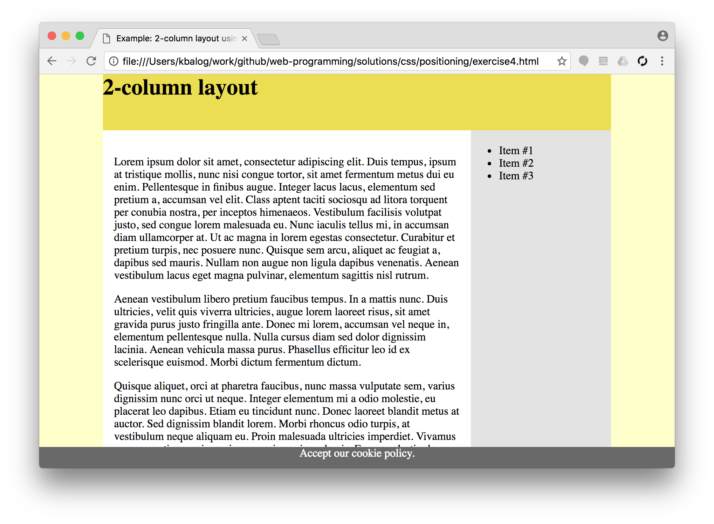
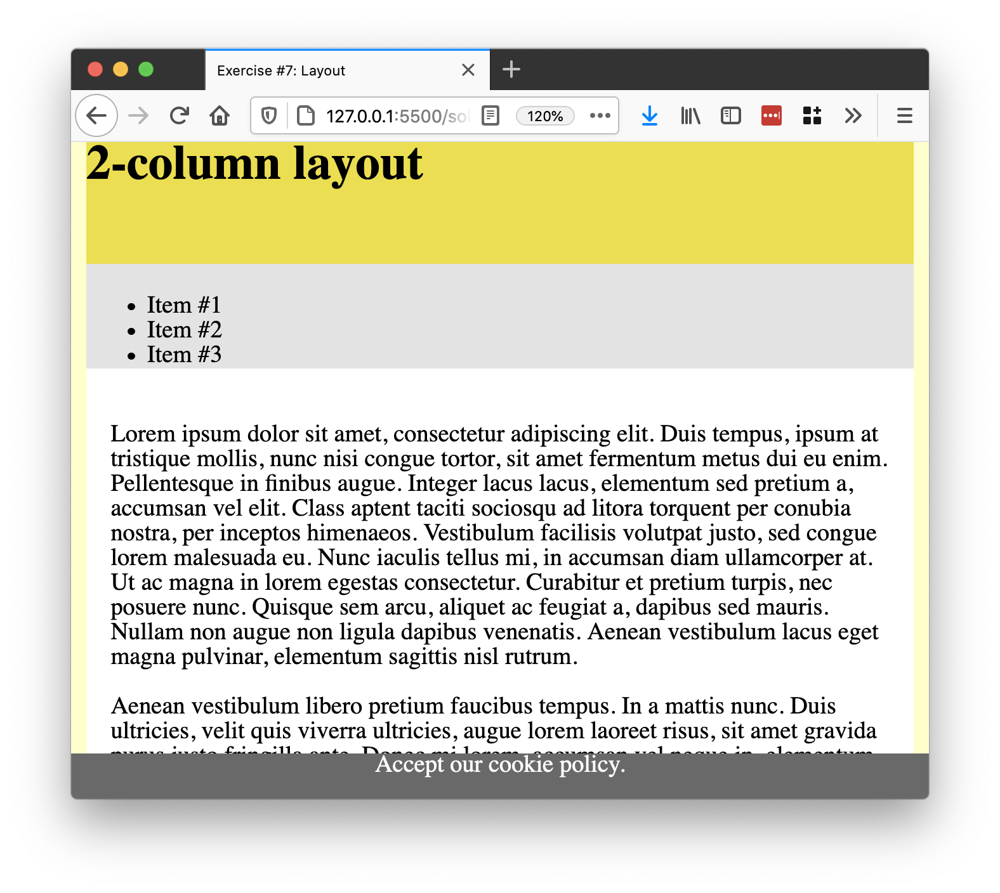

# CSS exercises, Part III. (positioning)

## Exercise #1: Hiding from a list

Make an unordered list with numbers ranging from 1 to 10 and assign a unique ID to each list element.
Then, implement the requirements below using page-level CSS.

  - Display all list elements next to each other.
  - Move the list to the left side of the page (by setting left padding to 0 on the list itself).
  - Style the list elements as follows:
    * Set some border and background color for the boxes around the list elements.
    * Set the text center-aligned within the boxes.
    * Set the width of the boxes to 3em.
  - Make all odd list elements hidden, so that they don't take up space.
  - Make the prime elements invisible, so that their space is left empty.

## Exercise #2: Positioning

The HTML files are given for each exercise. You are not allowed to edit the HTML structure (nor to add IDs or classes), only the CSS parts, inside `<style>`.

**#2a)** [Starter file](exercise2a.html)

Move the even boxes 10px up and the odd boxes 10px down with respect to their original position.

**#2b)** [Starter file](exercise2b.html)

Use absolute positioning to place the `left` and `right` elements to the left and right side of the container.

**#2c)** [Starter file](exercise2c.html)

Make the div with id `banner` appear in the top right corner of the page, 20px from the top and right sides of the window. Set the dimensions of the box to 120x480 and apply a 1px solid border around it. Display the image _images/banner_120x480.gif_ (by setting it as background to the div). The banner should stay at the same position even when the user scrolls the page.

## Exercise #3: Flexbox centering

[Starter file](exercise3.html)

  - Center the `inner` div withing the `box`, vertically and horizontally.
  - Use `text-align` property to also center the text.

## Exercise #4: Flexbox articles

[Starter file](exercise4.html)

  - Set some background color for the page and the articles.
  - Set the article dimension to 400x200px.
  - Use a flexbox to display the articles next to each other with 10px distance.
  - Ensure articles are wrapped to a new line.
  - Ensure articles grow, to take up the complete width.

## Exercise #4a: Flexbox directions

[Starter file](exercise4a.html)

  - Use a flexbox to ensure the image and description are displayed side by side on large screens and below each other on smaller screens.
  - Use another flexbox for the `description`. When displayed next to the image, the different paragraphs and heading should spread out.

## Exercise #5: Float icon

[Starter file](exercise5.html)

- Add an `x` icon in the top right corner of the article.
- The `x` should be 10px from the border and the text.
- Text should not overlap with the `x`.

## Exercise #6: Layout

Change the 2-column layout from the examples such that:

  - The "content part" (header, main, navigation) is center-aligned and takes 80% of the width of the browser window; it also has to be at least 600px but at most 960px wide (`min-width` and `max-width`).
  - The navigation menu is on the right and is 200px wide.
  - The main content is on the left; its width depends on the size of the window.
  - Set background colors `#ffffcc` for the body, `white` for main, and `#e3e3e3` for the navigation menu.
  - Add a footer with 30px height that is always visible and fills the entire width of the browser window.

*You may add container elements if necessary.*

Solve the exercise using **absolute postioning for the `nav` element.** Give the `main` content a margin that ensures, it does not overlap with the `nav` element.

## Exercise #7: Layout and media query

Recreate the layout from exercise 6 using flexbox and add a media query.

- Create the same layout as in exercise 6 using a flexbox around the `nav` and `main` element.
- Add a media query to change the following if the screen width is less than 800px:
  - Left and right margin of the "content part" is fixed to 10px.
  - `nav` is displayed above main over the complete width.

*Hint: Allow the flex items to wrap in the small layout. Note that both wrap and flex-direction can be used to reverse item order.*

