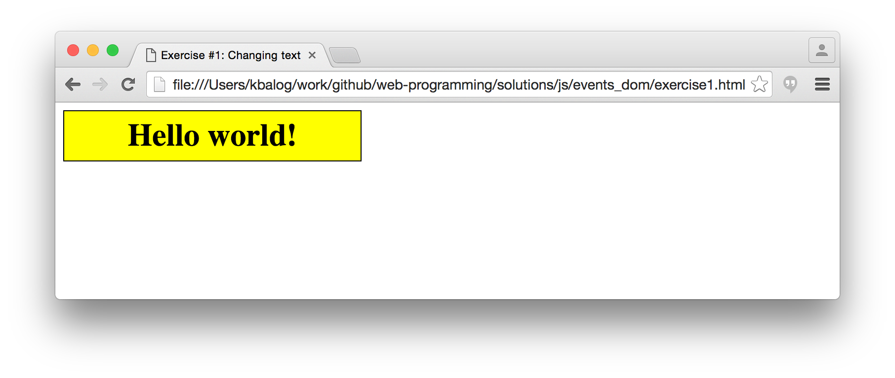
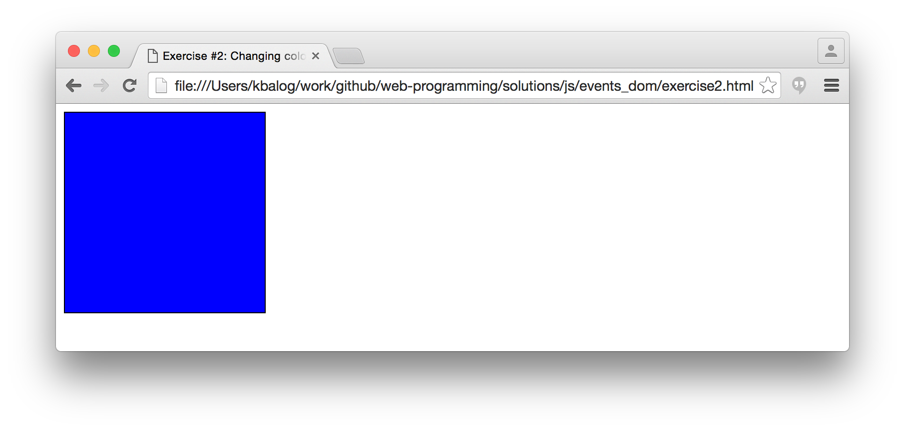
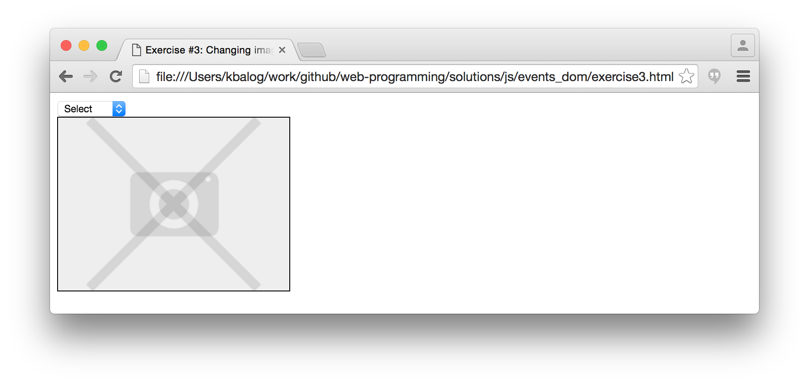
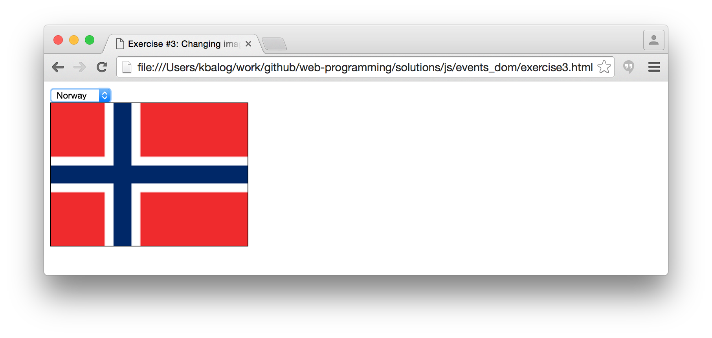
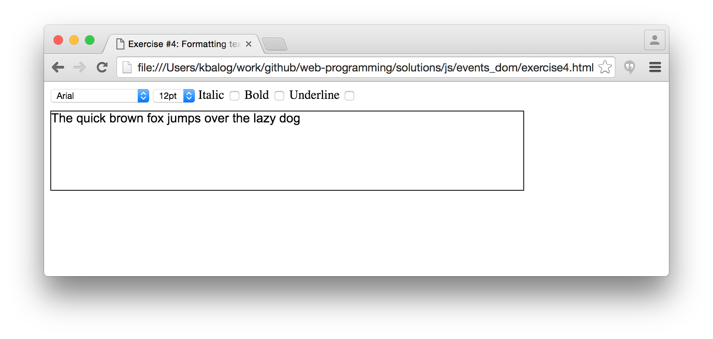

# JavaScript exercises, Part II. (events, DOM)

## Exercise #0: Find the error

Open [this page](exercise0.html) in the browser. Open the Javascript console. fix the errors displayed there.

## Exercise #1: Changing text

  - Extend [this HTML page](exercise1.html) such that on moving the mouse over the yellow box the text changes to "Can I help you?". Then, when the mouse is moved outside the box the text changes back to "Hello world!".

## Exercise #2: Changing colors

  - [This page](exercise2.html) contains a 200x200px div. Write JS code that sets the initial color of the div to blue, then changes the color when the div is clicked. On the first click, it changes from blue to red, on the next click from red to green, then from green to blue (and once it's blue, it starts all over again).
  - In this exercise, you are only allowed to make changes inside `` and cannot change other parts of the HTML code.

## Exercise #2b: Randomizing initial color

  - Extend the previous exercise such that the div's initial color is chosen randomly.
  - Can you extend the code to work with an array of arbitrary colors? Whenever the div is clicked, change the color to the next on in the array (and start over after the last color).

## Exercise #3: Changing images

  - The page shows a select list and a "no image" picture by default.
  - Once the user changes the selection in the list, display the selected image.
    * Set the src of the image to the option value and the alt of the image to the name of the option.

## Exercise #4: Formatting text

  - Create a simple what-you-see-what-you-get text editor.
  - Change the text inside the "text" div according to the form selections.
  - You can find the [starter HTML file with the form controls here](exercise4.html).

