# JavaScript exercises, Part III. (more JS)

## Exercise #1: Input check

  - You are [given a form](exercise1.html) with two password fields and a submit button.
  - Perform input check and display an error message next the the corresponding field if there is an error.
    * Passwords must be at least 6 characters long.
    * The two passwords must match.
  - The placeholders for the error messages have already been prepared (div-s with class "err").
  - By default the submit button should be hidden. Display the button only when there are no errors.

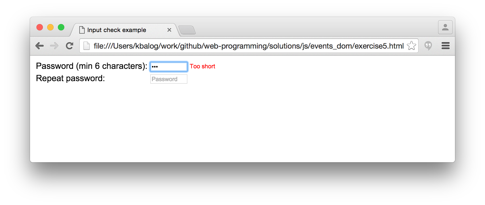

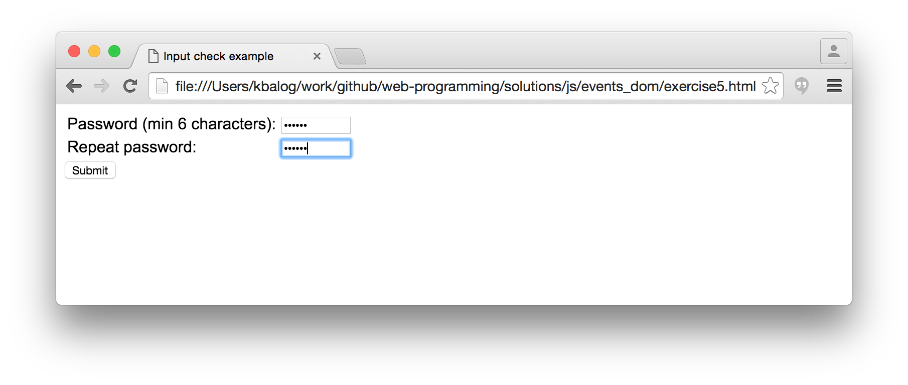

## Exercise #2: Content show/hide

  - You are given the [starter HTML file](exercise2.html).
  - By default, show only the article headings (this can be achieved by setting the display property of the div with the text to "none" using inline CSS).
  - Clicking the "show" link should make the article body appear and the "show" link to disappear.
  - Clicking the "hide" link should make the article body disappear and the "show" link appear.

  **Challenge:** Can you solve this exercise, without using ids, i.e. using [this file](exercise2b.html).
  
  *Tip: Use ParentElement and NextSibling*

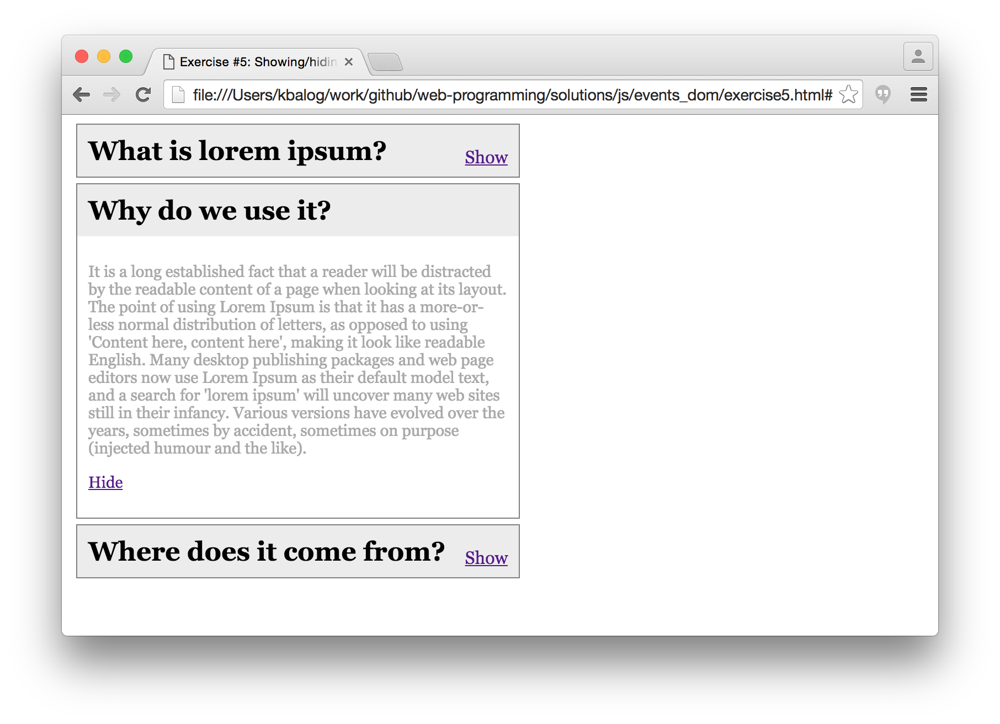

## Exercise #3: Simple playlist

  - Create a simple playlist application where users can add songs to a list. The song here is just a non-empty string.
  - The [starter HTML file](exercise3.html) contains the form and an empty playlist. There is an [external CSS file](exercise3.css) with the style declarations.

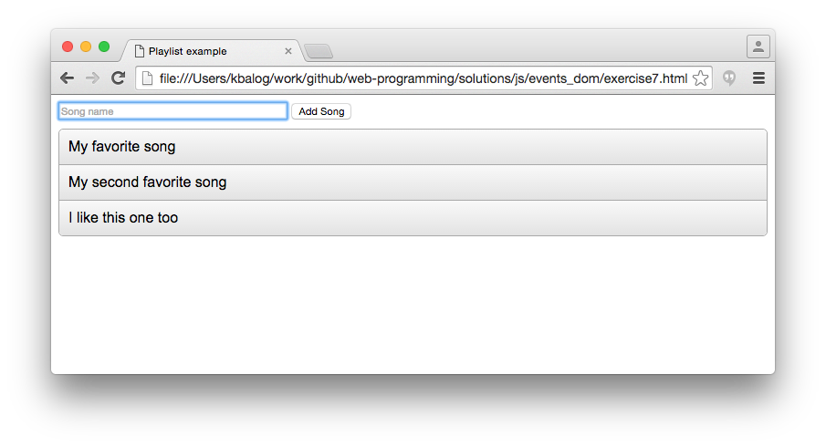

## Exercise #3b: Advanced playlist

  - Extend the previous exercise such that songs can be removed too. Add a delete link or icon to each song; clicking the link/icon should remove the song from the list.

## Exercise 4: Countdown timer

  - Make a countdown timer that counts back from the selected time. Check the starting files ([exercise4.html](exercise4.html) and [exercise4.js](exercise4.js)) which already provide you with a select list and code for processing the user input.
  - Show in large text the remaining time in MM:SS format and update the counter with each second elapsed. You can use the `getSecondDisplay` function.
  - In addition, show the remaining time in a progress bar. Set `max` and `value` attributes, and reset `value` every second.
    * Use the [HTML5 progress element](https://www.w3schools.com/tags/tag_progress.asp) (but remember to progress "backwards").
  - Display an alert when the time is up.

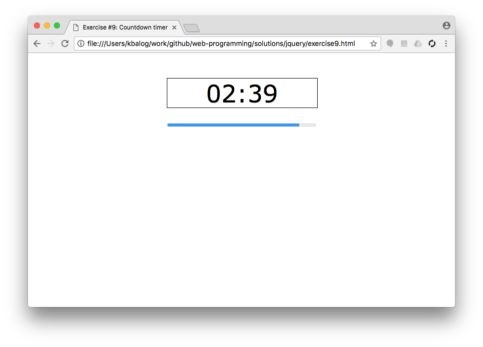

  - Can you use your timer several times? If not, why?

## Exercise #5: Card board

  - When the "Deal cards" button is pressed, create cards and place them in a grid layout, as specified in the select list (the format is `sizeCols x sizeRows`).
  - Adjust the board's width dynamically according to the layout (such that the grey background doesn't extend to the full width of the page).
    * I.e., the width of the `cardboard` div should be set to `sizeCols * cardWidth` px, where `cardWidth` includes border and margin.
  - By clicking on a card, it should disappear with some effect, while leaving its original place empty.
    * You can use the provided `turn` function for that.
  - The HTML and CSS files are already written, and you are not allowed to make changes to these.

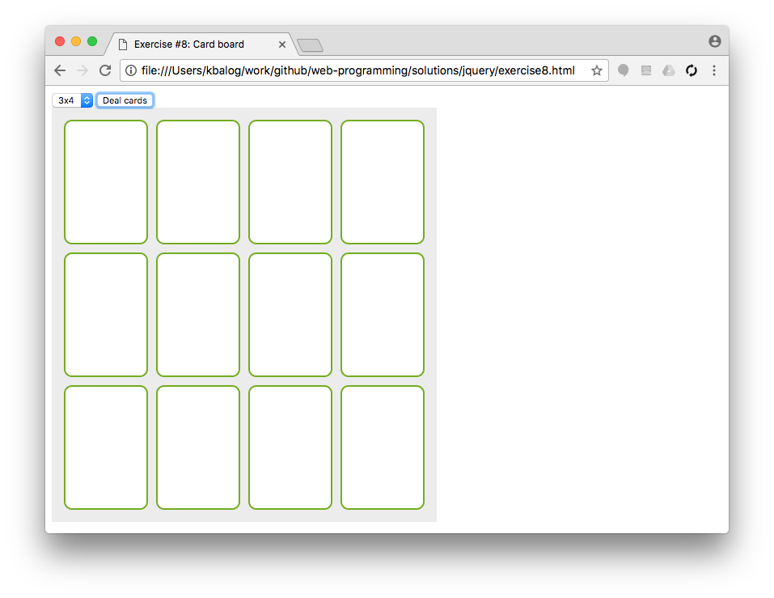
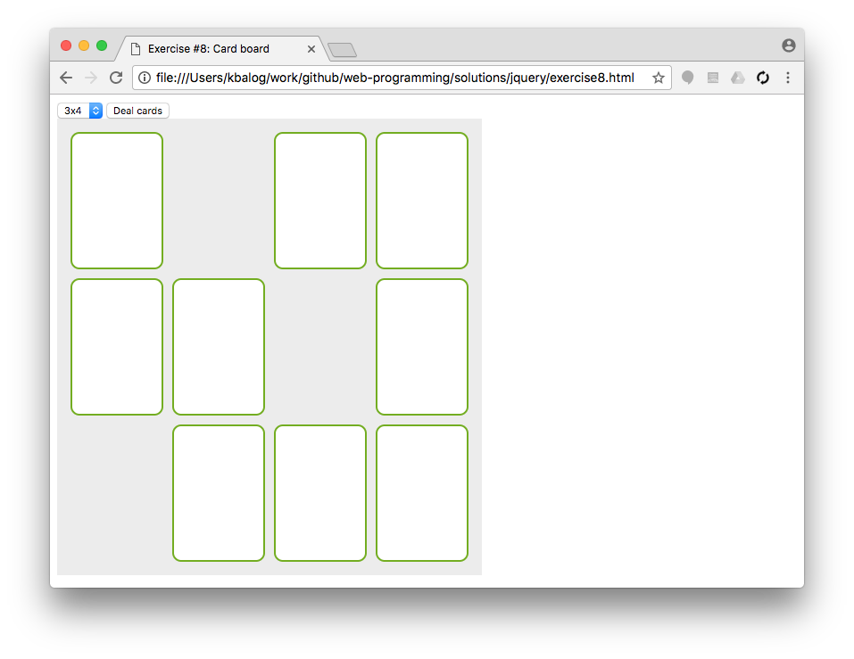

## Exercise #6: Color picker

  - Make a color picker that displays a color palette; display colored tiles (rectangles) in the "colors" div.
  - When a colored tile is clicked:
    * write the code of that color inside the "selected" div;
    * set the background of the "selected" div to that color.
  - You are given the [HTML file](exercise6.html) and [part of the JS code](exercise6.js) that collects the different colors in an array. (Only the JS file needs to be edited.)

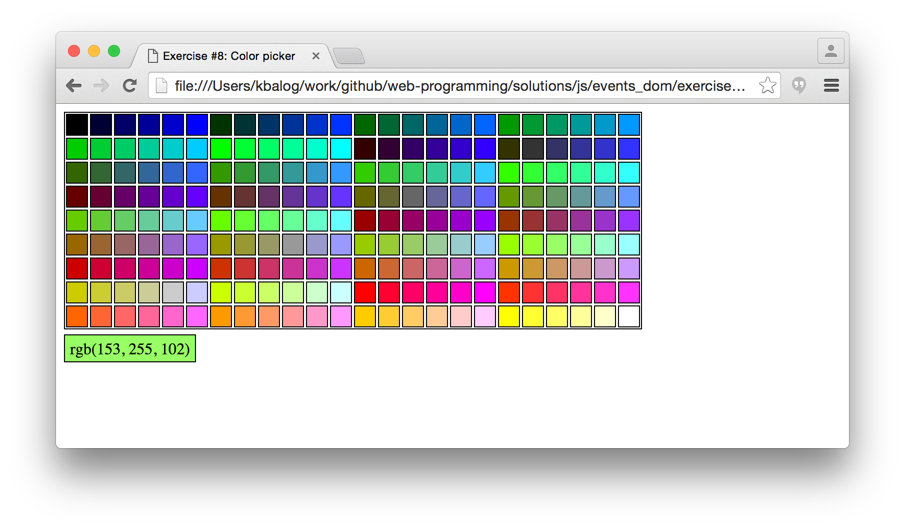

## Exercise #7: Labyrinth game

Make a game where the user (player) needs to find her way out from a labyrinth. The user controls a character (your choosing of hero) with the keyboard arrows. Follow the steps below. Use the starter files [game.html](game.html), [labyrinth.class.js](labyrinth.class.js), and [game.js](game.js).

### Step 1

  - The map of the labyrinth is given as a 2-dimensional array (1 represent walls 0 represent empty space). Implement a printConsole() method inside the [Labyrinth class](labyrinth.class.js) that prints the map on the browser console. Use `*` for walls and spaces for empty space.
   - Add the printConsole() method to the Labyrinth class.
   - Write JS code in [game.js](game.js) that creates a Labyrinth object and call the printConsole() when the page loads.

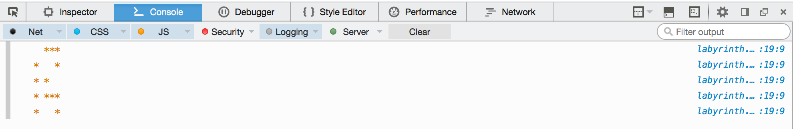

### Step 2

  - Implement a printDisplay(id) method that draws the labyrinth on the screen, inside the element with the provided id.
  - Call this method from `game.js` on the `map` div (instead of calling printConsole()).
  - Set the size of the parent (`map`) div according to the size of the labyrinth and apply a solid border around it.
  - Represent cells as rectangles (divs) with grey background for walls and white background for spaces. The `CELL_SIZE` global variable specifies the size (width and height) of rectangles.
  - You can use absolute positioning within the parent (`map`) div (but don't forget to set the positioning of the parent to non-static).

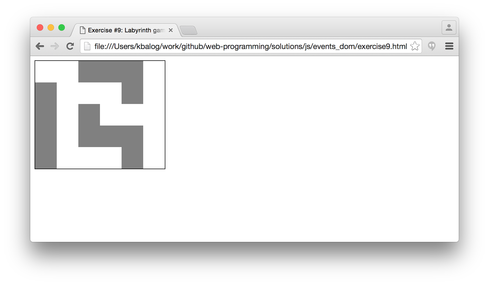

### Step 3

  - Extend the class with constants that specify the start and end (destination) coordinates of the character. Initially, the character stands at the start position.
  - Display the character on the map. You can use a div with a different background color or an image. Also, indicate the destination cell with a different background color or image.
  - Allow the user to move the character up, down, left, and right using the respective keys. For each move, check if the character would (i) move out of the map or (ii) move on a wall, and perform the actual move if there is an empty space to move to.
  - Display an alert window with "Congratulations!" if the character reaches the end (destination) cell.

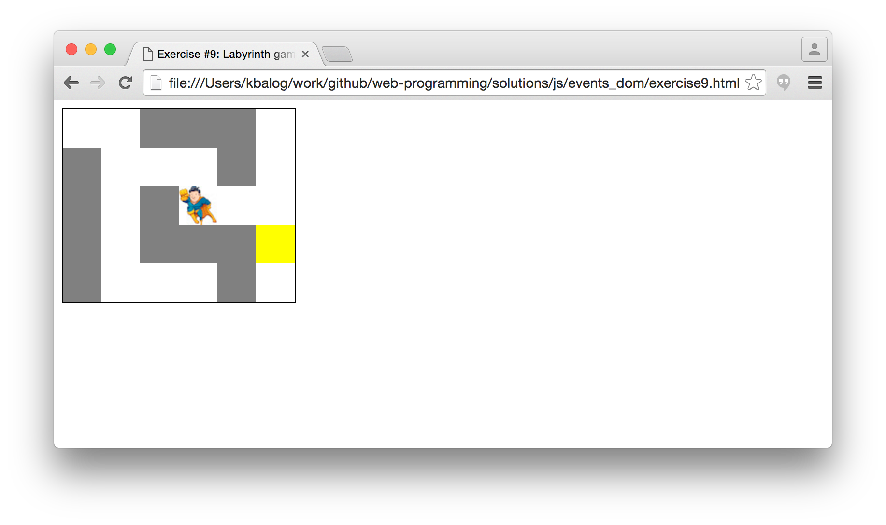
