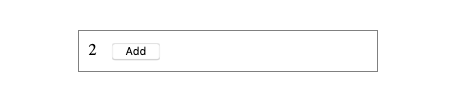
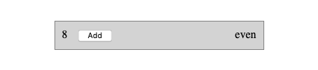
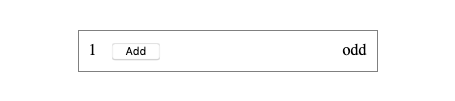
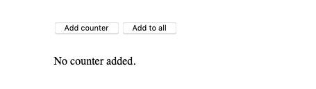
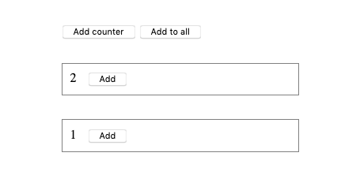
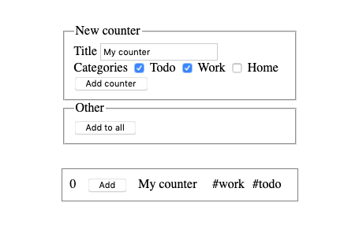
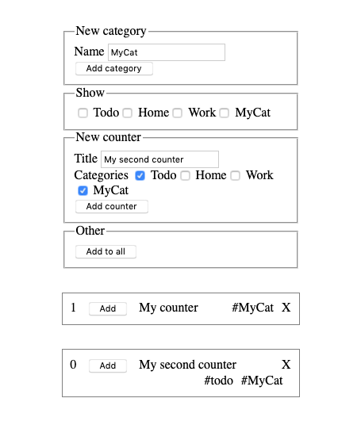

# Vue.js exercises, Part I. (basics)

I recommend to check out the [Vue.js documentation](https://vuejs.org/v2/guide/)

## Exercise #1: Counter

Recreate the [counter example](../../../examples/js/vue/no_vue/counter.html) using Vue.js. You can use this [starting file](exercise1.html).
  - When the button is clicked the count should be incremented by one. 

## Exercise #1b: Even and odd

Add the class *even* to the counter whenever the count is even.
Also add an element that shows if the counter is even or odd.
Additional features for `v-bind:class` are explained [here](https://v3.vuejs.org/guide/class-and-style.html#binding-html-classes).

## Exercise #2: Add counter

Recreate the [counter example](../../../examples/js/vue/no_vue/counter_prototype.html) using Vue.js. 
  - Initially a message *No counter* is displayed.
  
  - *Add counter* button allows to add an additional counter.
  - *Add to all* button increments all counters.
  

## Exercise #3: Counter title and categories

Add the following functionality to the counter from exercise 2.
  - A form that allows to specify a title for a counter.
  - Checkboxes to assign one or multiple categories to a counter.
  - When a counter is added, title and checkboxes should be displayed as in the image below.
  - Reset the title input after adding the a counter.
 

 ## Exercise #4: Dynamic categories

Add the following functionality to the counter from exercise 3.
  - A form including a text input and button, that allows to specify a new category.
  - After including a new category, allow to add counters with this category.
  - Every counter has a button or icon labeled X, that allows to remove this counter.
  - A show form, that allows to only show counters with one of the selected categories.

 
