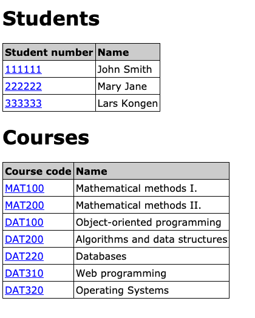

# Vue.js exercises, Part II. (components)

I recommend to check out the [Vue.js documentation](https://vuejs.org/v2/guide/)

## Exercise #1: Logo

[Exercise 1](exercise1.html) contains an input field for color and buttons with differend font-awesome icons.
Create a Vue.js application such that, 
- the circle around the big icon always reflects the color from the color input.
- when a button is clicked, the big icon changes to show the icon from this button.
- the buttons are displayed using a *v-for* loop.


## Exercise #2: Create components

Create components for the [playlist example application](../../../examples/js/vue2/list).
  - One component for a **playlist item**. 
      * Playlist item component contains the state, how often a song was played. 
      * Playlist item component emits an event when a song should be removed.
  - One component for the form.
      * This component emits an event, when a new song is added.
      
  

## Exercise #3: Paragraph edit

The example application [Exercise3](exercise3) shows Lorem ipsum in 3 languages.
You should create a component that allows to edit individual paragraphs.
  - On double click the paragraph is displayed inside a `<textarea>`.
  - After editing, the user can click a button, to close the `<textarea>`.
  - The paragraph shows the updated text, also after changing back and forth to a different language.

*Challenge*: Instead of a button, close the `<textarea>` on pressing enter.
Use this function to handle a `keypress` event:
```javascript
close: function($event){
            if ($event.keyCode == 13){
              //close the textarea here
            }
```
 

## Exercise #4: Data store

The example application [Exercise4](exercise4) shows a Vue application, similar to the ongoing assignment.
Build a store for this application. The goal is to remove as many props as possible, and especially remove data 
from the root app.

 

## Exercise #4b: Data store adding

Extend exercise 4 with the another component that allows to add grades to the store.
