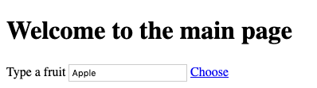
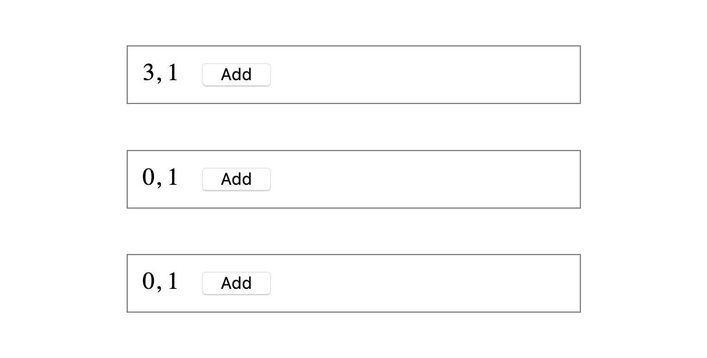

# Vue.js exercises, Part III. (store, routing, CLI)

## Exercise #1: Vue instance as store

Starting with this [example](../../../examples/js/vue3/gradebook). 
Refactor main, student, and course components to not use `data` but only `computed` properties.
Verify that the list in the course component is now reactive.

## Exercise 2: Vue router

Create a simple routing app with two pages. You can use [exercise2.html](exercise2.html) as starting file.
The main route `\` displays a header, an input field and a link.
The link should lead to route `\fruit\:name` where name is the current value of the input field.

On route `\fruit\:name` a different page is displayed, that
shows `name` in the header. 
This page contains a link to the main page.
Example below shows the page for `\fruit\apple`.

## Exercise 3: Grades router

Introduce a router to the gradebook application from exercise 1. 
You can use the [solution](../../../solutions/js/vue3/exercise1) as a starting point.

Challenge: You can also try to addapt the solution, such that if a student_no is used for which no student exists, an error is shown.

## Exercise 4: Single file components

- Install node.js, including npm. https://nodejs.org/en/download/ 
- Download the [playlist example](../../../examples/js/vue3/playlist-cli).
- Run `npm install` in the folder you downloaded. This should create a folder (`node_modules`) including all dependencies.
- Run `npm run serve` to test the playlist application.

## Exercise 4b: 

Run `npm -g install @vue/cli` on the command line.
Run `vue create counters` to create a new project.
Port [this](../../../examples/js/vue2/counters) counter example to your new project, using single file components.

