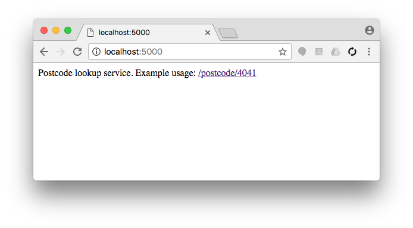
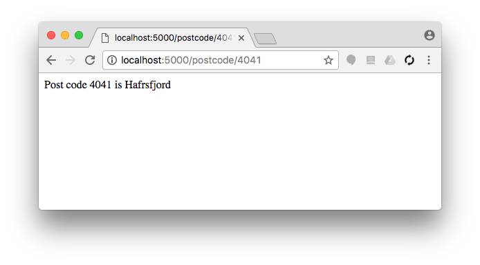
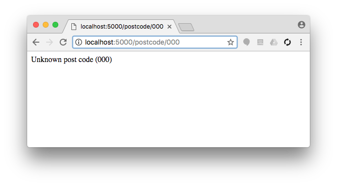
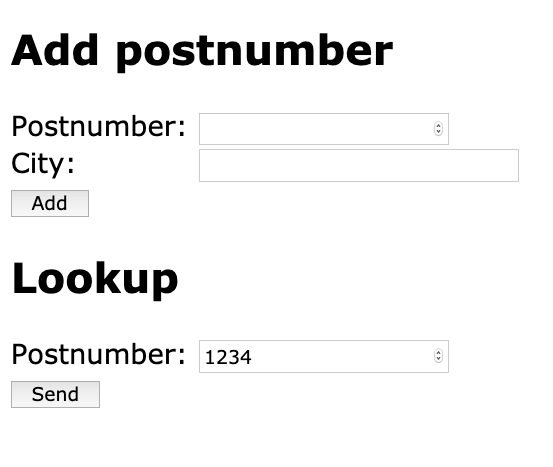
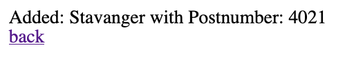

# Server Side Programming exercises (Python, Flask), Part I.

Documentation: [Flask quickstart](http://flask.pocoo.org/docs/0.12/quickstart/#quickstart)

## Exercise #0: Test Flask Application

Launch the [minimalistic Flask application](../../../examples/python/flask/0_minimal/app.py) and test it by making a request to it from a browser (http://localhost:5000).


## Exercise #1: Post code lookup service

Create a flask application that can look up location names based on the post code.  Store the locations in a dictionary, e.g.,
```
postcodes = {
    "0001": "Oslo",
    "4036": "Stavanger",
    "4041": "Hafrsfjord",
    "7491": "Trondheim",
    "9019": "Tromsø"
}
```

If the user goes to the index page, return the text "Postcode lookup service. Example usage: /postcode/4041", where the example link should be generated automatically (using `url_for()`) and should be a link (`<a href>...</a>`)


If the post code exists, return the text "Post code {postcode} is {city}"


Otherwise return "Unknown post code ({postcode})"


## Exercise #2: Post code lookup form

Extend the post code lookup service to use forms and allow to add postcodes.

The main paige should show two forms, one for lookup and one to add new postcodes.


After submitting a form, the result is displayed on a new page, together with a link back to the form.


Optional: *Add validation, to ensure no empty values are added to the dictionary.*