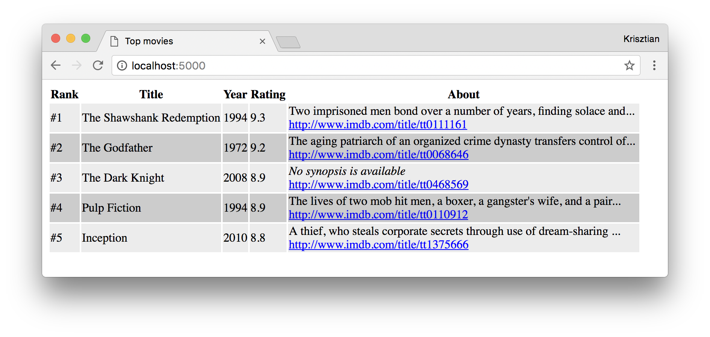
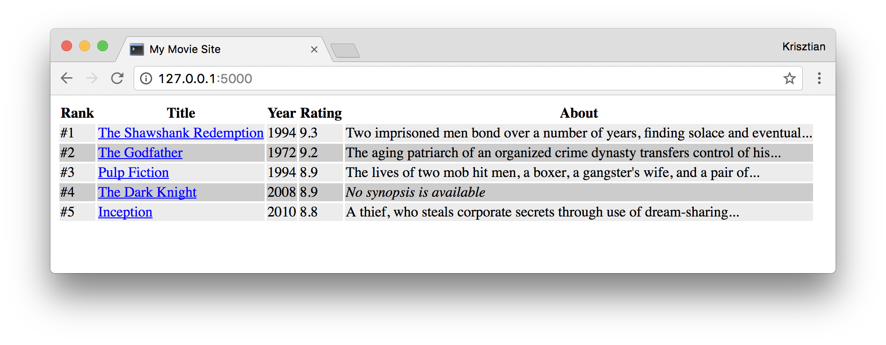
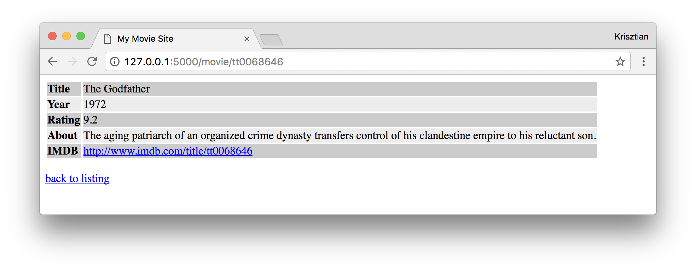

# Server Side Programming exercises (Python, Flask), Part III.

  * [MySQL Connector/Python](https://dev.mysql.com/doc/connector-python/en/)
  * [Flask QuickStart](http://flask.pocoo.org/docs/0.12/quickstart/)
  * [Jinja Templates](http://jinja.pocoo.org/docs/2.10/templates/)


## Exercise #0: Set up MySQL

* Create a python script that initializes a SQLite database and create a table `movies`.
* The table should have the following columns:
    - `imdb_id TEXT` we'll use the IMDB movie IDs as a unique identifier and PRIMARY KEY
    - `title TEXT`
    - `year INT`
    - `rating DOUBLE`
    - `synopsis TEXT`
* Add some movies to the table.
* [movies.sql] holds some SQL scripts you could use.

Alternatively, you can just execute the `movies.sql` script from the command line:
```
$ sqlite3 ./database.db < movies.sql
```

## Exercise #1: Listing movies

Update [Exercise 4 from the last lecture on flask](../../../solutions/python/flask2/ex_4) such that movies are loaded from the MySQL database.

Specifically,

  * Remove the `MOVIES` const; this data will need to be loaded from the database.
  * Make a connection to the database (make sure the DB and the movies table have been created).
  * Make a `SELECT` query that returns all movies from the table.
  * Notice that are not storing the IMDB URLs in the database. You'll need to generate the links to the IMDB movie pages from the `imdb_id` field. Do that in the `movies.html` template file (i.e., not in `app.py`).

The output should look exactly as before:



## Exercise #2: Movie details

Generate a separate "details" page for each movie.

  * Remove the links to the IMDB profile page from the movie listing. Instead, make the title of the movie a link to `/movie/<movie_id>`, where `movie_id` refers to the `id` field in the `movies` table.
  * Make a `layout.html` file that contain a common header and footer. The movie listing and movie details pages should extend `layout.html`.



