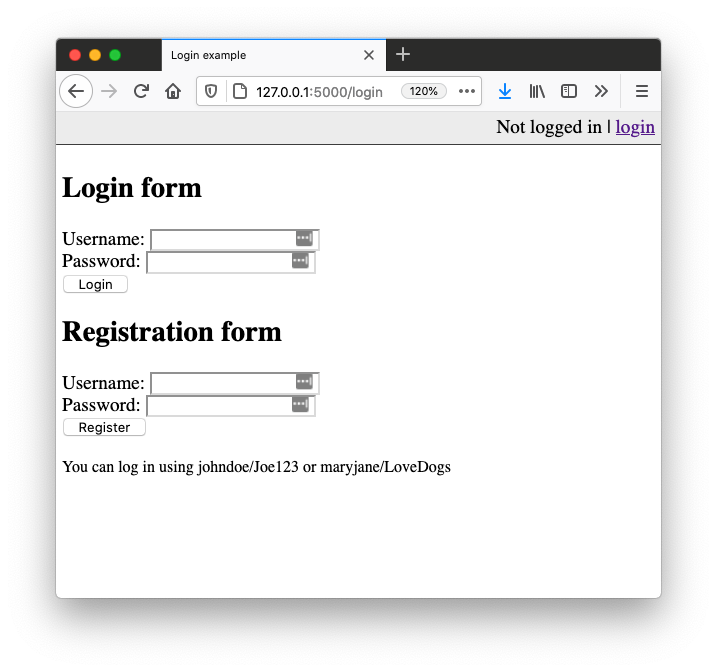
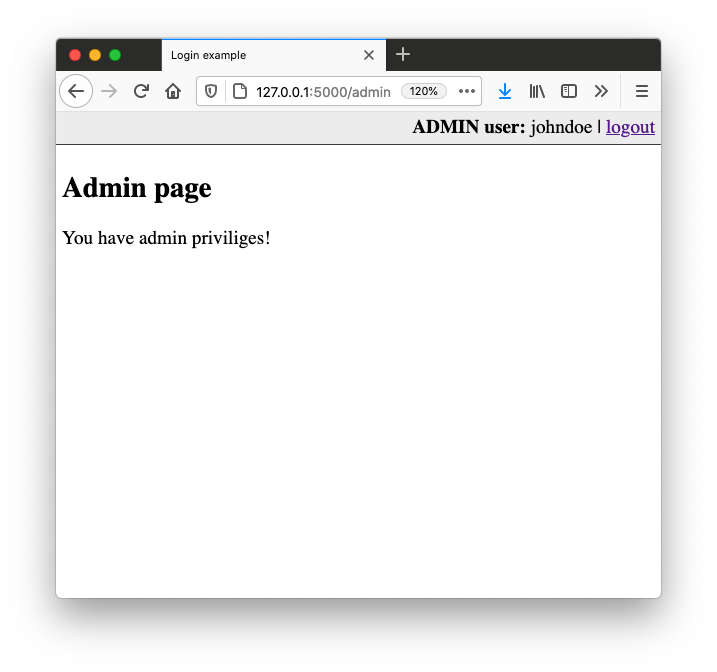

# Login with (Python, Flask), Part V.

## Exercise #1: Create database

Write a script, similar to [sqlite1.py](../../../examples/python/sqlite/sqlite1.py) that creates a SQLite database and a table to store user data.
The table should contain:
* A username (TEXT, NOT NULL)
* Password hash (TEXT, NOT NULL)

The table should also enforce that usernames are unique.

Write methods 
* Create the table
* Insert a user into the table
* Retrieve a user, based on his name

## Exercise #2: Login and signup

Update the [login example](../../../examples/python/flask/9_login) to use the database you created.
Further extend the example to allow signup. 

## Exercise #3: Authentication

Extend your application with user roles, e.g. `admin` and `user`.
You need to:
* Extend the user table to contain a user `role`
* Extend the login and logout, to store/remove the current user role in the session
* Create an additional route, e.g. `/admin` that is only accessible to admin users.
* If a non admin user accesses this route (e.g. typing it into the address field) the server should return a 403 error.

